# Agent Builder

** 重要提示：下文会涉及4种agent：

1. Agent Builder：这是用来创建和配置Entrance Agent的agent，它本身也有子agent
	- PrimaryAgent
  - SubAgent
2. Entrance Agent：这是用户最终使用到的agent
  - skill：这个是挂载在Entrance Agent身上的agent。


## 产品功能概述
Agent Builder是一个基于langchain的deep agent框架的Agent构建工具（其本身是个deep agent），通过对话式交互的方式，帮助用户快速创建和配置Entrance Agent。
Agent Builder需要支持的工具和subagent包括：

deep agent框架： https://github.com/langchain-ai/deepagents

见`## Agent Builder（PrimaryAgent）`和 `## Agent Builder（SubAgent）`


创建的Agent的结构主要包含两大部分：
- Entrance Agent
  - name
  - description
  - ROLE DEFINITION（本质是system prompt）
  - Entrance Agent本身不会有任何工具（除了call skill agent）
- skills
  - 每个skill都是一个single agent，demo阶段每个agent仅一个skill即可，通过在主agent中call skill agent来调用

具体参照Agent配置结构。


## 前端展示
1. 需要展示Agent Builder的对话式交互界面，且在和用户交互过程中，需要实时展示Agent Builder的对话流程（streaming）、以及todo list和tool的调用，
2. 需要在Agent Builder对话的第一轮，直接创建Entrance Agent的name
3. 需要在Entrance Agent创建完成后，展示Entrance Agent的对话式交互界面和配置界面（包括name、description、ROLE DEFINITION、skills，以及skills中的tools和knowledge base）
4. 需要在Entrance Agent创建完成后，mock一个Entrance Agent的对话流程

## 主要的技术框架参考

| 层级 | 技术 | 说明 |
|------|------|------|
| **前端框架** | Streamlit | Python Web 框架，快速构建交互式应用 |
| **Agent 框架** | LangChain DeepAgents | 强大的 Agent 构建框架 |
| **LLM API** | Claude / GPT / Gemini | 支持多种大语言模型 |
| **监控工具** | LangSmith | LangChain 官方监控和调试平台 |
| **Python 版本** | Python 3.12 | 必须使用 Python 3.12 |
| **环境管理** | uv | 快速的 Python 包管理工具 |


## 模块命名

参考：

[LangSmith Agent Builder - Docs by LangChain](https://docs.langchain.com/langsmith/agent-builder)

[Agent Builder in Microsoft 365 Copilot | Microsoft Learn](https://learn.microsoft.com/en-us/microsoft-365-copilot/extensibility/agent-builder)

## 技术选型

DeepAgent


## 流程图

```json
┌─────────┐     ┌────────────┐     ┌────────────┐     ┌────────────┐
│planning │────▶│ collecting │────▶│ generating │────▶│ validating │
└─────────┘     └────────────┘     └────────────┘     └────────────┘
                      ▲                                      │
                      │                                      │
                      │              ┌────────────┐          │
                      └──────────────│  (需补充)   │◀─────────┘
                                     └────────────┘
                                           │
                                           ▼
                                    ┌────────────┐     ┌──────────┐
                                    │ confirming │────▶│ creating │
                                    └────────────┘     └──────────┘
```



```mermaid
graph TD
    Start([用户: 帮我创建一个酒店预约助手]) --> Parse[Agent Builder 解析需求]
    
    Parse --> Plan[生成 TODO 计划]
    Plan --> TODO1{TODO 1: 收集基本信息}
    TODO1 --> Collect[信息收集: Agent 基本信息]
    Collect --> Form1[表单交互/澄清: 其他必要信息]
    Form1 --> |用户填写| FormData1[语言: auto & 其他信息]
    
    FormData1 --> TODO2{TODO 2: 分析所需技能}
    TODO2 --> SkillAnalysis[分析预约场景需要的技能]
    SkillAnalysis --> SkillList[识别技能:<br/>1. 查询酒店房型<br/>2. 预订房间<br/>3. 查询订单<br/>4. 修改/取消订单]
    
    SkillList --> TODO3{TODO 3: 生成技能配置}
    TODO3 --> CallSkillAgent[调用 SkillGeneratorAgent]
    
    CallSkillAgent --> SearchMarket[搜索技能广场]
    SearchMarket --> |找到匹配| PresetSkill[预制技能: 酒店预订]
    SearchMarket --> |未找到| CustomSkill[自定义技能]
    
    PresetSkill --> ConfirmSkill[确认交互: 使用预制技能?<br/>酒店预订 ⭐4.9 使用2156次]
    ConfirmSkill --> |是| UsePreset[复制技能模板]
    ConfirmSkill --> |否| CustomSkill
    
    CustomSkill --> GenPrompt[generate_skill_prompt<br/>生成技能提示词]
    GenPrompt --> MatchTools[匹配工具和知识库]
    
    UsePreset --> MatchTools
    MatchTools --> SearchTools[search_tool_marketplace<br/>查找: 查询房型API, 预订API, 订单查询API]
    SearchTools --> SearchKB[search_kb_marketplace<br/>查找: 酒店FAQ, 预订政策, 退改规则]
    
    SearchKB --> SkillConfig[生成完整技能配置]
    SkillConfig --> |技能1完成| NextSkill{还有其他技能?}
    NextSkill --> |是| TODO3
    NextSkill --> |否| TODO4{TODO 4: 生成系统提示词}
    
    TODO4 --> GenSystemPrompt[生成 system_prompt:<br/>你是专业的酒店预订助手...]
    GenSystemPrompt --> TODO5{TODO 5: 配置校验}
    
    TODO5 --> CallValidator[调用 ValidatorAgent]
    CallValidator --> ValidateSchema[validate_schema<br/>检查必填字段]
    ValidateSchema --> ValidateTools[check_tool_exists<br/>验证工具: 查询房型API ✓]
    ValidateTools --> ValidateKB[check_kb_exists<br/>验证知识库: 酒店FAQ ✓]
    ValidateKB --> ValidatePrompt[evaluate_prompt<br/>评估提示词质量: 优秀]
    
    ValidatePrompt --> ValidationResult{校验结果}
    ValidationResult --> |有错误| FixErrors[ClarifierAgent<br/>生成澄清问题]
    FixErrors --> UserFix[用户补充信息]
    UserFix --> TODO5
    
    ValidationResult --> |通过 ✓| TODO6{TODO 6: 用户确认}
    TODO6 --> PreviewConfig[展示配置预览<br/>4个技能, 3个工具, 3个知识库]
    PreviewConfig --> AuthorizeInteraction[授权交互: 确认创建?]
    
    AuthorizeInteraction --> |查看详情| ShowDetail[显示完整 JSON<br/>包含所有技能配置]
    ShowDetail --> AuthorizeInteraction
    
    AuthorizeInteraction --> |继续编辑| BackToEdit[返回编辑]
    BackToEdit --> TODO3
    
    AuthorizeInteraction --> |确认创建 ✓| TODO7{TODO 7: 创建 Agent}
    TODO7 --> CallCreateAPI[调用 create_agent API]
    CallCreateAPI --> SaveConfig[保存配置到数据库]
    SaveConfig --> InitAgent[初始化 Agent 实例]
    InitAgent --> Success([创建成功! 🎉<br/>agent_id: agent_hotel_001<br/>可立即使用])
    
    style Start fill:#e1f5ff
    style Success fill:#c8e6c9
    style TODO1 fill:#fff9c4
    style TODO2 fill:#fff9c4
    style TODO3 fill:#fff9c4
    style TODO4 fill:#fff9c4
    style TODO5 fill:#fff9c4
    style TODO6 fill:#fff9c4
    style TODO7 fill:#fff9c4
    style Form1 fill:#ffe0b2
    style ConfirmSkill fill:#ffe0b2
    style AuthorizeInteraction fill:#ffe0b2
    style CallSkillAgent fill:#e1bee7
    style CallValidator fill:#e1bee7
    style ValidationResult fill:#ffcdd2
```

## Agent Builder（PrimaryAgent）

主控制 Agent Builder，负责整个自动化 Agent 生成流程的调度与决策。

需要state（demo的是memory级别的即可）

所有需要写入的操作都是通过checkpointer来完成的，没有沙盒。

### 中间件（Middleware）

#### TodoListMiddleware

工具列表：

*   `write_todos`：用于跟踪正在进行的工作以及仍需完成的工作
    

#### FilesystemMiddleware

工具列表：

*   `ls`: 列出文件
    
*   `read_file`: 读取文件或文件中的特定行数
    
*   `write_file`: 写入文件
    
*   `edit_file`: 编辑文件
    

#### SubAgentMiddleware

工具列表：

*   默认工具
*   `ask_user_to_provide_info`: 用于向用户获取信息（用interrupt实现）
*   `ask_user_to_confirm_build: 在sop生成完成后，用于用户确认是否开始构建agent（用interrupt实现）

    

## Agent Builder（SubAgent）


### WebSearchAgent

用于网络搜索、获取网页内容等功能。

工具列表：

*   `web_search`：网络搜索

*   `fetch_webpage_content`：获取网页内容
    

### ConfigManagerAgent

根据SOPGenerationAgent生成的sop，生成标准的配置文件。

*   `write_file`：写入配置。
*   `edit_file`：编辑配置。

*   `validate_config`：分析配置完整性 -> demo暂时不做。
    
    *   Schema校验
        
    *   质检

### MockConversationAgent
用于生成Entrance Agent的示例对话


## 交互协议

###  交互类型定义

```python
class InteractionType(Enum):
    CONFIRM = "confirm"     # 确认选择
```

### 交互消息格式

#### 确认交互 (confirm)

```json
{
  "type": "interaction",
  "interaction_type": "confirm",
  "interaction_id": "int_002",
  "title": "确认技能配置",
  "message": "已识别到以下技能，是否确认？",
  "items": [
    {"name": "订单查询", "description": "查询订单状态和物流"},
    {"name": "发起退款", "description": "处理退款申请"}
  ],
  "actions": [
    {"id": "confirm", "label": "确认", "primary": true},
    {"id": "edit", "label": "编辑"},
    {"id": "add", "label": "添加更多"}
  ]
}

```

### 用户响应格式

```json
{
  "interaction_id": "int_001",
  "action": "submit",
  "data": {
    "agent_name": "智能客服助手",
    "description": "处理用户咨询和售后问题",
    "category": "客服"
  }
}
```


## Entrance Agent配置结构

### 主配置schema

```json
{
  "$schema": "http://json-schema.org/draft-07/schema#",
  "type": "object",
  "required": ["name", "description", "system_prompt", "skills"],
  "properties": {
    "name": {
      "type": "string",
      "minLength": 1,
      "maxLength": 100,
      "description": "Agent名称"
    },
    "description": {
      "type": "string",
      "minLength": 1,
      "maxLength": 500,
      "description": "Agent功能描述"
    },
    "system_prompt": {
      "type": "string",
      "minLength": 10,
      "description": "系统提示词，定义Agent的角色和行为"
    },
    "skills": {
      "type": "array",
      "minItems": 1,
      "items": {
        "$ref": "#/definitions/Skill"
      },
      "description": "技能列表"
    }
  },
  "definitions": {
    "Skill": {
      "type": "object",
      "required": ["name", "when_to_use", "prompt"],
      "properties": {
        "name": {
          "type": "string",
          "minLength": 1,
          "maxLength": 50,
          "description": "技能名称"
        },
        "when_to_use": {
          "type": "string",
          "minLength": 10,
          "maxLength": 500,
          "description": "使用场景描述，用于技能路由判断"
        },
        "prompt": {
          "type": "string",
          "minLength": 10,
          "description": "技能专属提示词"
        },
        "tools": {
          "type": "array",
          "items": {
            "$ref": "#/definitions/Tool"
          },
          "description": "绑定的工具列表列表"
        }
      }
    },
    "Tool": {
      "type": "object",
      "required": ["tool_id", "name"],
      "properties": {
        "tool_id": {
          "type": "string",
          "description": "工具ID"
        },
        "name": {
          "type": "string",
          "description": "工具名称"
        },
        "config": {
          "type": "object",
          "description": "工具配置参数"
        }
      }
    }
  }
}
```

### 更新协议

参考代码生成，对配置的更新不应每次都全量更新，应支持增量更新

### 数据转换

构建用的config需要和agent和skill的数据结构进行双向转换

**SingleAgent**

**Skill**

### 版本控制(草稿/回滚)

### 系统内置工具


*   SMS：发送短信给用户（voice场景）
    
*   Email：发送Email给用户
    
*   Google Calendar：读写google日历（需要在skill级别配置用哪个日历）
    
*   Google Sheet：读写google表格（需要在skill级别配置用哪个sheet）
    
*   Shopify：商品推荐
    
*   Amazon：从亚马逊获取商品信息
    
*   Rakuten：应该也是个电商平台，可以先不管
    
*   Logistics Tracking：物流查询（不确定是否需要填供应商）
    
*   Knowledge Reply：知识回复（这个比较特殊一些，是agent界面上的一个开关）
    
*   Transfer：转人工（这个也比较特殊）
    